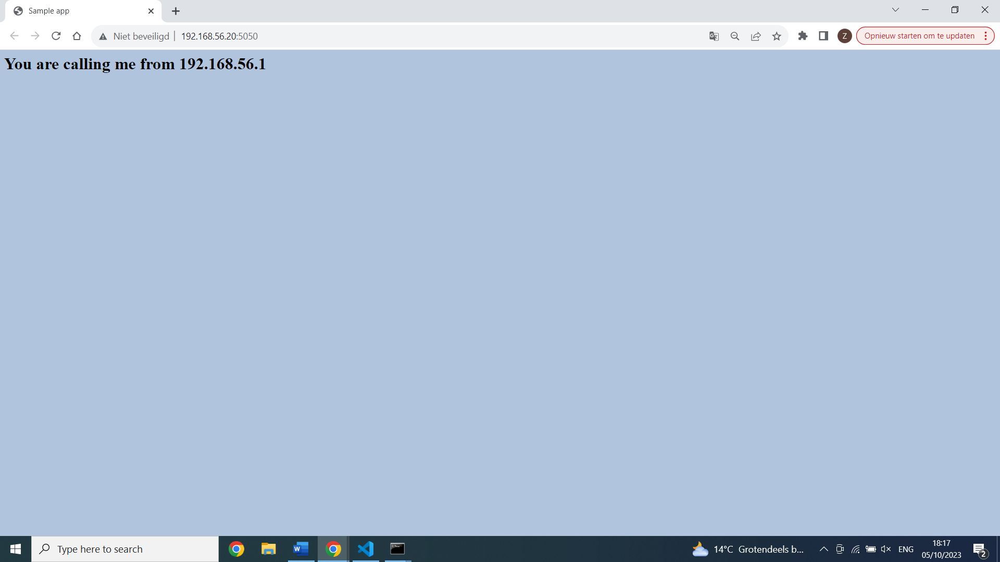
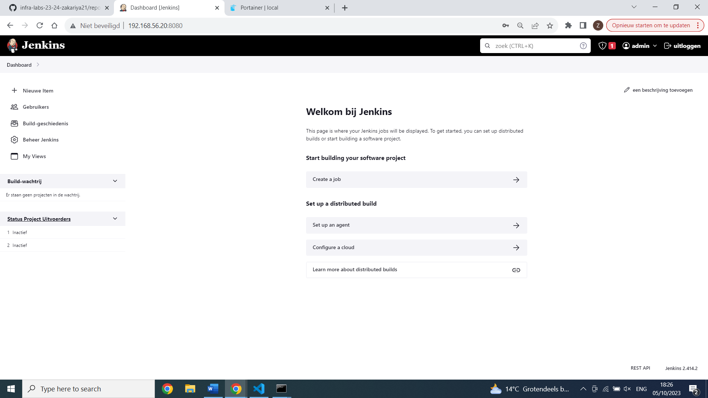
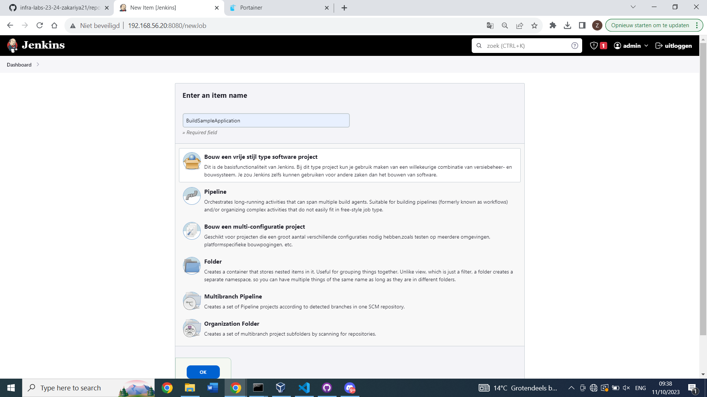
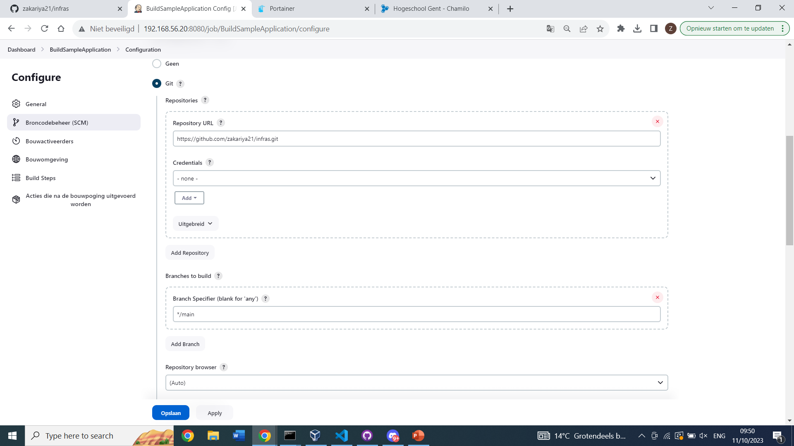
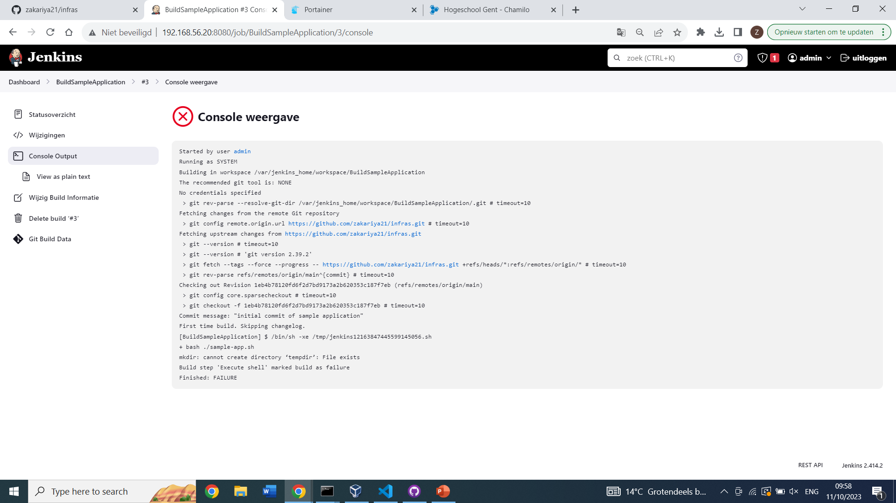

# Lab Report:  Continuous Integration/Delivery with Jenkins

## Commands

# opstart
- vagrant up
- vagrant ssh
# portainer
- sudo docker restart portainer
- http://192.168.56.20:9000/
  

  # set up lab omgeving
- git config --global --list
- git config --global user.name "zakariya21"
- git config --global user.mail "zakariya.mouloud@student.hogent.be"

- git init
- git add .
- git commit -m "commit tekst"

- git remote add origin (git ssh)
- git branch -M main
- git push -u origin main
# sample applicatie
- cd /vagrant/cicd-sample-app
- ./sample-app.sh
- http://192.168.56.20:5050/
- 
- docker stop samplerunning
- docker remove samplerunning
# jenkins image + config
- docker pull jenkins/jenkins:lts
-  docker run -p 8080:8080 -u root \
      -v jenkins-data:/var/jenkins_home \
      -v $(which docker):/usr/bin/docker \
      -v /var/run/docker.sock:/var/run/docker.sock \
      -v "$HOME":/home \
      --name jenkins_server jenkins/jenkins:lts

- http://192.168.56.20:8080/
- 758fdf884712490993b23345ed2eadbd
- 
# gebruik jenkins
- 
- 
- 
- 
-> fix door toevoeging "if [ -d tempdir ]; then
rm -rf tempdir
fi"  in het script dat de directory "tempdir" verwijderdt indien deze al bestaat
## Resources

List all sources of useful information that you encountered while completing this assignment: books, manuals, HOWTO's, blog posts, etc.
